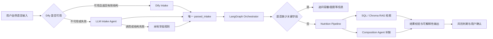

# DrinkMind 饮品摄入陪伴助手

DrinkMind 是一个面向咖啡、奶茶、果茶等饮品记录场景的 Agentic Workflow 项目。它支持用户用自然语言记录饮品，并结合 SQL 知识库、Chroma/RAG 检索、成分规则估算、风险判断、可解释性 trace 和人工反馈审核流程，估算饮品的咖啡因与糖分摄入。

项目重点不是做一个简单聊天机器人，而是把 LLM、检索、规则和人工审核放进一个可控、可追踪、可回归测试的后端工作流里。

## 核心能力

- 自然语言饮品解析：从用户输入中解析品牌、品名、容量、甜度、饮品类型等字段。
- LangGraph 工作流编排：将饮品解析、字段追问、知识检索、营养估算、风险判断和结果解释拆成可追踪节点。
- 混合营养估算策略：优先使用已审核 SQL 知识库；其次使用 Chroma/RAG 相似检索；缺少可信匹配时降级到成分规则估算。
- Composition Estimation：根据咖啡基底、茶基底、奶基底、果汁基底、糖浆等组件估算咖啡因和糖分。
- 可解释性输出：保存 graph trace、估算方法、命中知识 ID、检索分数、成分拆解、假设条件和 warning。
- Human-in-the-loop 反馈闭环：支持用户纠正估算结果，将反馈转成 evidence，经审核后写入正式知识库。
- 离线评估：提供 composition eval 和 agent effect eval，用于检查估算结果、工具路径、风险判断、追问逻辑和离线稳定性。

## 技术栈

- 后端：Python、FastAPI、SQLAlchemy、Alembic、SQLite
- Agent / AI 应用：LangGraph、LangChain、OpenAI-compatible API
- 检索与知识库：Chroma、SQL 知识库、RAG 相似检索
- 前端：Vite、JavaScript、HTML、CSS
- 测试与评估：unittest、离线 eval、PowerShell quality gate

## 系统流程



营养估算工作流位于 `backend/workflows/nutrition_pipeline.py`，主要节点包括：

- `normalize_input`
- `lookup_knowledge`
- `route_estimation`
- `use_knowledge_result`
- `composition_decompose`
- `composition_estimate`
- `verify_result`
- `build_explainability`

## 快速开始

### 1. 安装前端依赖

```bash
cd frontend
npm install
```

### 2. 安装后端依赖

```powershell
cd backend
python -m venv venv
.\venv\Scripts\activate
pip install -r requirements.txt
```

### 3. 配置环境变量

```powershell
copy backend\.env.example backend\.env
```

默认情况下，项目可以在离线模式下运行测试和核心规则流程。需要调用真实 LLM 时，再编辑 `backend/.env`：

```env
OPENAI_API_KEY=your_openai_api_key_here
BASE_URL=https://api.openai.com/v1
MODEL_NAME=gpt-4o-mini
VISION_MODEL_NAME=gpt-4o-mini
ENABLE_LLM=false
DRINKMIND_OFFLINE=false
CORS_ALLOW_ORIGINS=http://localhost:5173,http://127.0.0.1:5173
```

本地密钥和私有配置请写入 `backend/.env`，示例配置保留在 `backend/.env.example`。

### 可选：接入 Dify 陪伴助手

项目可以把陪伴问答和饮品自然语言解析优先交给 Dify Chatflow。Dify 返回的
`parsed_intake` 会直接进入本地 LangGraph，不会再被本地解析器重复解析。

```env
COMPANION_PROVIDER=dify
DIFY_BASE_URL=https://api.dify.ai/v1
DIFY_API_KEY=your_dify_app_api_key
DIFY_USER_ID=drinkmind-local-user
DIFY_TIMEOUT_SECONDS=60
```

FastAPI 会把今日咖啡因、今日糖分、睡眠时长、用户偏好和最近聊天记录作为
Chatflow 输入变量发送给 Dify。Dify 不可用、请求失败或返回的饮品结构不合法时，
系统依次降级到结构化 LLM Intake Agent 和本地字段规则；规则仍无法得到必要字段时
才向用户追问。营养数值始终由本地 SQL/RAG 与营养 LangGraph 计算。
真实密钥只能保存在 `backend/.env`，不要写入前端或提交到版本库。

### 4. 初始化数据库

```powershell
cd backend
.\venv\Scripts\python.exe -m alembic upgrade head
```

### 5. 初始化本地 RAG 知识库

```powershell
cd backend
.\venv\Scripts\python.exe -m scripts.init_rag
```

### 6. 启动后端

```powershell
cd backend
.\venv\Scripts\python.exe -m uvicorn main:app --reload
```

后端默认运行在：

```text
http://127.0.0.1:8000
```

### 7. 启动前端

```bash
cd frontend
npm run dev
```

Vite 会输出本地访问地址，通常是：

```text
http://localhost:5173
```

也可以在 Windows PowerShell 中使用演示启动脚本：

```powershell
.\scripts\start_demo.ps1
```

## 测试与评估

运行后端单元测试：

```powershell
cd backend
.\venv\Scripts\python.exe -m unittest discover -s tests
```

运行 Composition Estimation 评估：

```powershell
cd backend
.\venv\Scripts\python.exe tests\run_composition_eval_report.py
```

运行 Agent Effect 评估：

```powershell
cd backend
.\venv\Scripts\python.exe tests\run_agent_effect_eval_report.py
```

运行自建模拟输入评估：

```powershell
cd backend
.\venv\Scripts\python.exe tests\run_synthetic_agent_eval_report.py --compare-baseline --write-doc
```

该评估集覆盖完整饮品记录、缺字段追问、品牌别名、口语表达和摄入建议等 100 条固定模拟输入，用于量化意图识别、动作选择、字段解析和缺字段召回表现。`--compare-baseline` 会在同一批数据上对比 legacy baseline 与当前规则，生成 `docs/synthetic_agent_eval_report.md`。它是固定场景下的离线评估，不代表生产环境真实准确率。

运行完整本地质量检查：

```powershell
powershell.exe -ExecutionPolicy Bypass -File .\scripts\quality_gate.ps1
```

质量检查包括：

- 后端 unittest
- Composition eval
- Agent effect eval
- 前端构建

## 推荐演示路径

1. 启动后端和前端。
2. 输入一条自然语言饮品记录，例如“记录一杯库迪超燃生椰美式 650ml 无糖”。
3. 展示 Agent 解析出的品牌、品名、容量和甜度。
4. 展示没有可信知识命中时进入 Composition Estimation。
5. 展开估算结果的技术细节，查看 graph trace、成分拆解、assumptions 和 warnings。
6. 提交一次营养纠正反馈。
7. 在 evidence 审核面板中查看并审核反馈证据。
8. 审核通过后再次记录同款饮品，展示已审核知识库优先命中。
9. 运行 eval，展示 agent 行为和估算流程可回归测试。

## 项目结构

```text
backend/
  main.py                         FastAPI 应用入口与路由注册
  api/                            API schema 与 routers
  services/                       业务服务层
  db/
    database.py                   SQLAlchemy models、session 与数据库连接
  agents/
    orchestrator.py               LangGraph agent 路由与主流程
    intake_parser.py              自然语言饮品解析
    companion_agent.py            陪伴式建议回复
    memory_extractor_agent.py     用户偏好提取
    report_agent.py               报告生成
  rules/                          确定性规则、成分估算、风险判断
  knowledge/                      知识检索、Chroma/RAG、证据采集与审核
  workflows/
    nutrition_pipeline.py         LangGraph 营养估算 workflow
  migrations/                     Alembic 数据库迁移
  scripts/                        后端维护脚本
  tests/                          单元测试与离线 eval

frontend/
  src/
    api.js                        前端 API client
    components/                   Vue 聊天框、数据库面板、审核 UI
    composables/                  Vue 组合式逻辑
    state.js                      前端状态
    storage.js                    本地存储
  tests/                          前端单元测试与烟雾测试
  package.json                    Vue/Vite 依赖与命令
  vite.config.js                  Vite 配置

scripts/
  quality_gate.ps1                本地质量检查脚本
  start_demo.ps1                  本地演示启动脚本

docs/
  项目七层架构.md                 架构说明文档
```

## 数据说明

- 项目中的咖啡因和糖分结果用于饮品摄入记录与估算展示，不代表专业营养或医疗建议。
- Composition Estimation 输出的是基于成分规则的估算值，实际结果会受品牌配方、门店制作和杯型差异影响。
- 用户纠正的数据会先进入 evidence 审核流程，审核通过后才会写入正式知识库。
