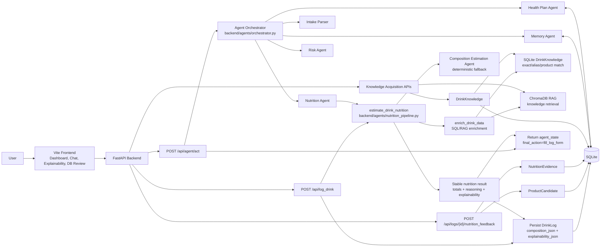
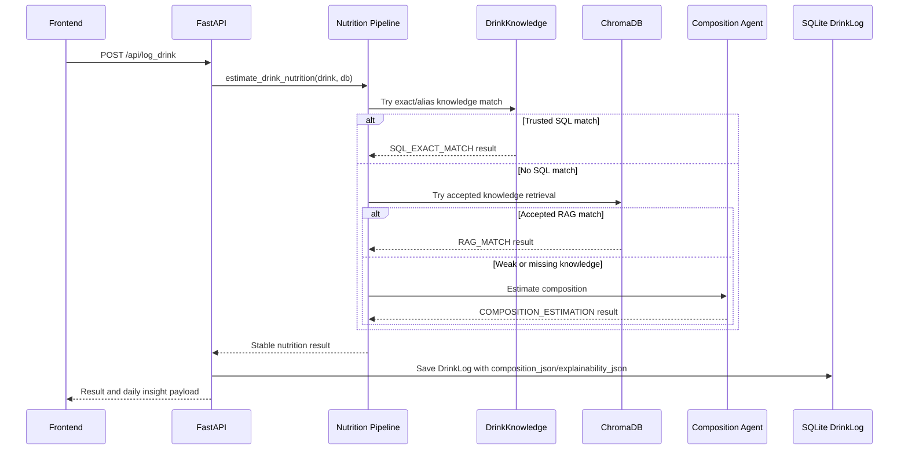
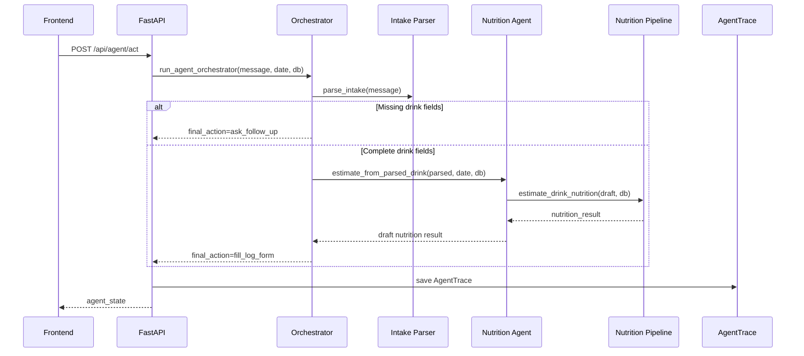
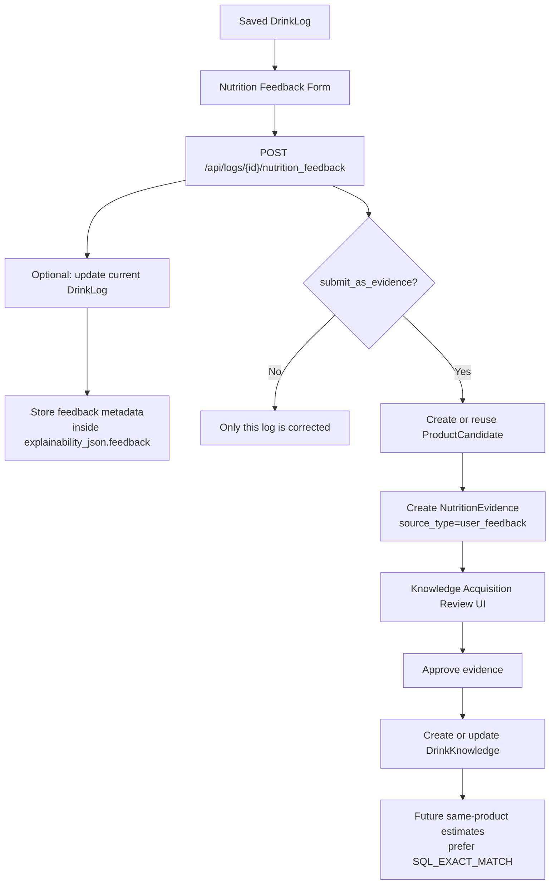

# DrinkMind Architecture

This document describes the current DrinkMind implementation. It focuses on the
real data paths in the app: manual drink logging, agent-assisted draft logging,
knowledge-prioritized nutrition estimation, Composition Estimation fallback,
saved explainability, and the Human Feedback Loop.

## 1. Current System Overview

## 2. Nutrition Pipeline Contract

The shared entry point is `estimate_drink_nutrition(drink, db)` in
`backend/agents/nutrition_pipeline.py`.

It first calls the existing enrichment path, then decides whether to keep a
trusted knowledge result or replace weak fallback estimates with deterministic
Composition Estimation.

Current priority:

1. Keep `SQL_EXACT_MATCH`.
2. Keep accepted `RAG_MATCH`.
3. Replace `LLM_ESTIMATION` and `LOCAL_ESTIMATOR` with Composition Estimation
   when possible.
4. Also use Composition Estimation when there is no matched knowledge ID and
   confidence is below the pipeline threshold.
5. Normalize the final result into stable fields: `caffeine`, `sugarContent`,
   `data_source`, `confidence`, `reasoning`, `estimation_method`,
   `matched_knowledge_id`, `retrieval_score`, `composition`, and
   `explainability`.

The Composition Estimation Agent is deterministic. It estimates drink
components such as espresso, milk base, tea base, fruit base, and syrup, then
builds component-level reasoning and warnings.

## 3. Manual Logging Path

`POST /api/log_drink` is the path that persists a consumed drink.

Persistence details:

- `composition_json` stores structured component estimates when Composition
  Estimation is used.
- `explainability_json` stores method, knowledge-match state, confidence,
  reasoning, assumptions, warnings, and feedback metadata when present.
- `GET /api/logs` deserializes those JSON fields so the frontend can replay
  saved explainability from historical logs.

## 4. Agent-Assisted Logging Path

`POST /api/agent/act` does not directly save a `DrinkLog` for drink logging.
It returns a draft nutrition result and `final_action="fill_log_form"` so the
frontend can fill or confirm the log form.

This distinction matters for demos and documentation: the agent path prepares a
structured draft, while `/api/log_drink` is the path that persists the actual
consumed drink.

## 5. Explainability Replay

When a drink is persisted through `/api/log_drink`, the API stores the normalized
pipeline output on `DrinkLog`.

The frontend can later:

- Fetch logs through `GET /api/logs`.
- Click a historical log.
- Rebuild the Nutrition Explainability panel from saved `composition` and
  `explainability`.
- Show whether the estimate used knowledge, Composition Estimation, assumptions,
  warnings, and prior feedback metadata.

This replay is persistence-based; it does not re-run the estimator.

## 6. Human Feedback Loop

Feedback corrects one saved drink log immediately and can optionally stage
reviewable evidence for future estimates.

The feedback endpoint does not write directly to `DrinkKnowledge`. This keeps
the trust boundary clear: users can fix their own log immediately, but reusable
knowledge must pass through review.

## 7. Knowledge Acquisition

Knowledge Acquisition manages product candidates and nutrition evidence.

Implemented paths include:

- Manual candidate creation.
- Evidence creation for a candidate.
- Image analysis staging/import flow.
- Evidence approval into `DrinkKnowledge`.
- ChromaDB synchronization after knowledge approval.
- Bulk approval and deletion helpers.

Approved evidence can become future exact SQL knowledge, which the nutrition
pipeline keeps ahead of Composition Estimation.

## 8. Agent Trace, Memory, And Health Plans

`AgentTrace` records observability fields for agent runs:

- `trace_id`
- `intent`
- `agents_called`
- `tools_used`
- `retrieved_docs`
- `model_name`
- `latency_ms`
- `confidence`
- `final_action`
- `error`

Memory stores user preferences and goals in `UserPreference`. The Health Plan
Agent creates and updates 7-day plans in `HealthPlan`. These are active agent
features, but they are separate from the nutrition persistence path.

## 9. Main Persistent Objects

| Object | Purpose |
| --- | --- |
| `DrinkLog` | Saved consumed drinks, totals, method metadata, `composition_json`, and `explainability_json`. |
| `DrinkKnowledge` | Reviewed reusable nutrition knowledge used by SQL exact matching and Chroma sync. |
| `ProductCandidate` | Review candidate that may become knowledge. |
| `NutritionEvidence` | Reviewable nutrition evidence for a candidate. |
| `AgentTrace` | Agent execution observability. |
| `UserPreference` | Memory preferences and goals. |
| `HealthPlan` | 7-day plans and progress. |
| `ChatLog` | Chat history. |

## 10. Demo Talking Points

1. Manual logging persists explainability; agent logging prepares a draft.
2. SQL/RAG knowledge has priority over Composition Estimation.
3. Composition Estimation provides structured fallback reasoning instead of a
   black-box final number.
4. Saved explainability can be replayed from history.
5. Feedback fixes one log immediately but only becomes reusable knowledge after
   review.
6. The quality gate keeps backend behavior, composition eval, and frontend build
   aligned.
