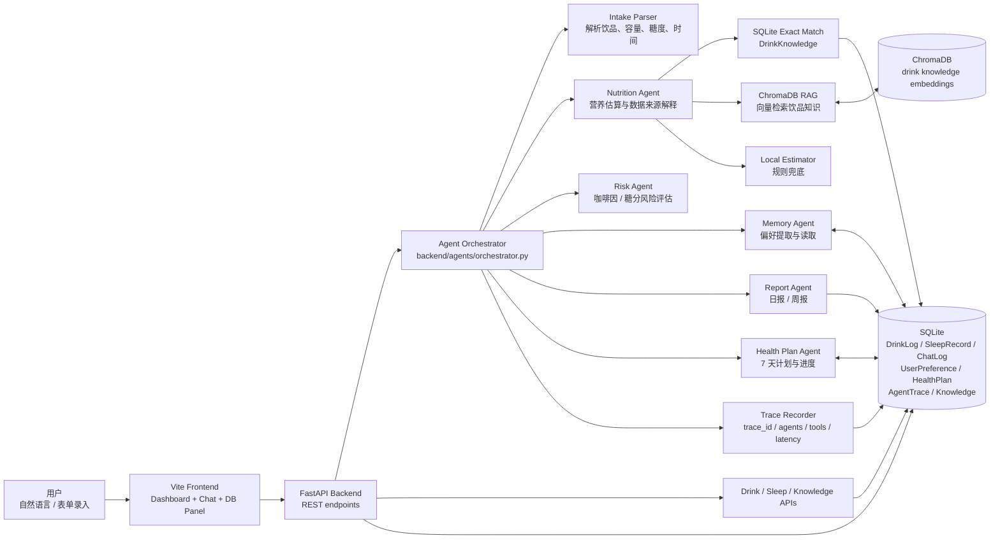
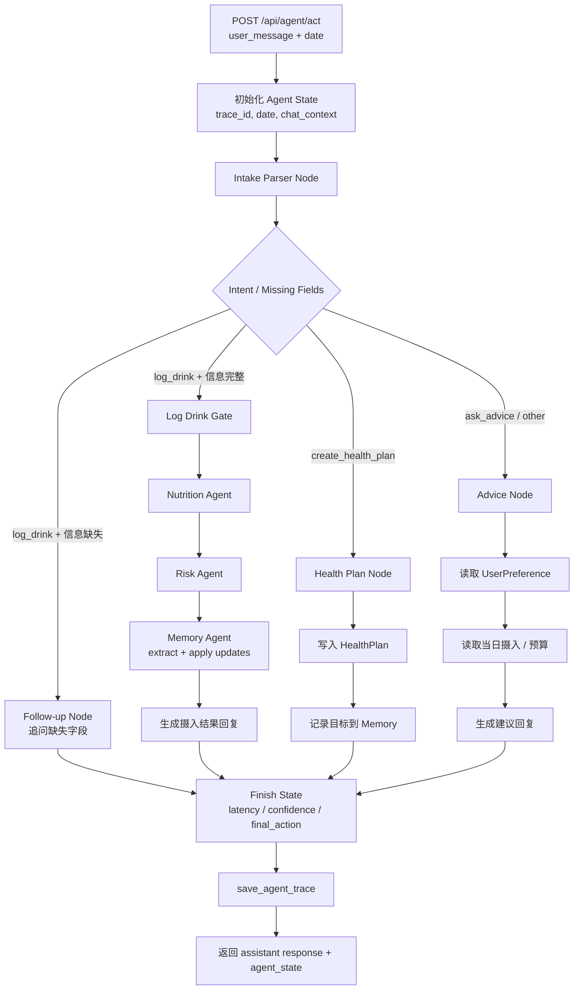
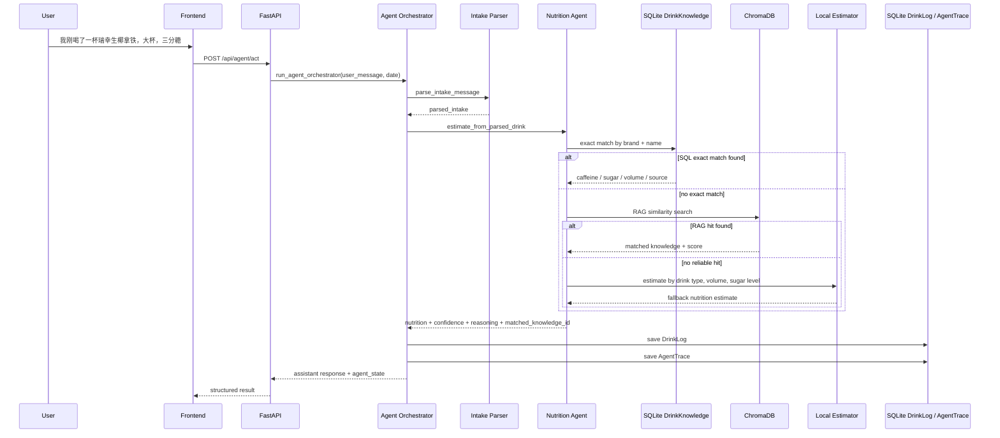
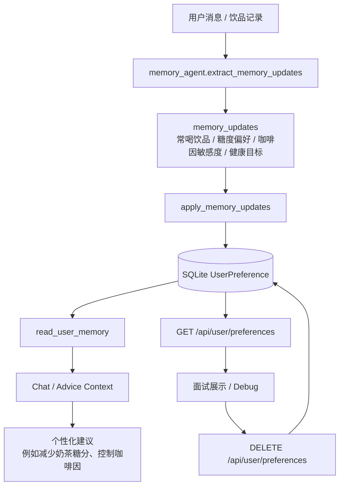
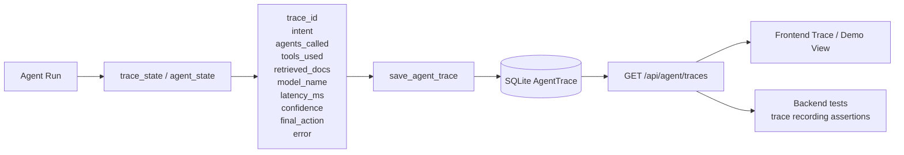
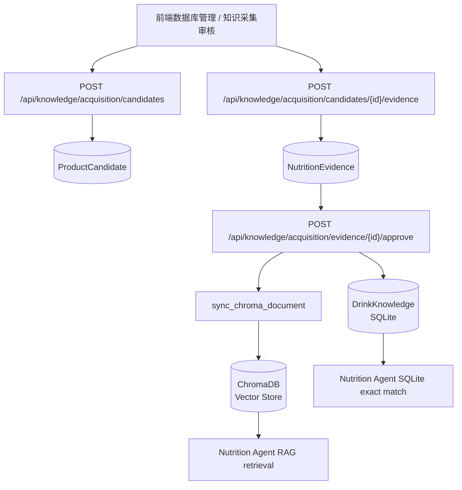

# DrinkMind Architecture

本文档说明 DrinkMind 的 multi-agent 架构、核心数据流，以及 RAG、Memory、Trace 在系统中的位置。它面向简历项目说明和面试展示，重点解释“用户一句自然语言如何变成可追踪、可落库、可个性化的健康建议”。

## 1. 总体架构

## 2. Multi-Agent 路由

`POST /api/agent/act` 是主要入口。后端会创建 `DrinkMindAgentState`，再由 orchestrator 根据解析结果和用户意图路由到不同 Agent 节点。

### Agent State 关键字段

- `trace_id`：一次 Agent 执行的唯一 ID。
- `intent`：解析后的用户意图，例如 `log_drink`、`ask_advice`、`create_health_plan`。
- `parsed_intake`：饮品名称、品牌、容量、糖度、时间等结构化字段。
- `agents_called`：本次执行经过哪些 Agent 节点。
- `tools_used`：本次执行用到的工具或策略，例如 local parser、SQLite exact match、RAG retrieval。
- `retrieved_docs`：RAG 或知识库命中的文档 ID。
- `memory_updates`：从本轮对话中提取出的偏好或目标。
- `final_action`：最终动作，例如记录饮品、追问字段、生成建议或创建计划。

## 3. 饮品录入与 RAG 营养估算数据流

这条链路展示“自然语言饮品记录”如何进入知识检索和营养估算流程。

## 4. Memory 数据流

Memory 的目标是让系统在后续建议里“记得用户偏好”，但仍然保持可检查、可清空，方便 demo 和测试。

## 5. Trace 可观测性数据流

Trace 用来解释 Agent 为什么这么回答、走过哪些节点、用了哪些工具，也能帮助测试 agent routing 是否正确。

## 6. Knowledge Acquisition 数据流

知识采集流程用于把新增饮品和营养证据纳入可检索知识库。

## 7. 主要持久化对象

| 表 / 对象 | 用途 |
| --- | --- |
| `DrinkLog` | 用户每天的饮品摄入记录，包括 caffeine、sugarContent、alcoholContent、data_source、confidence、reasoning。 |
| `DrinkKnowledge` | 饮品知识库，供 SQLite exact match 和 ChromaDB 同步使用。 |
| `UserPreference` | Memory 存储，例如偏好、敏感度、目标。 |
| `HealthPlan` | 7 天健康计划及每日进度。 |
| `ChatLog` | 用户与助手的对话历史。 |
| `AgentTrace` | Agent 执行链路，支持观测、调试和测试。 |
| `ProductCandidate` | 待审核饮品候选。 |
| `NutritionEvidence` | 候选饮品的营养证据。 |

## 8. 面试讲解建议

可以按下面顺序讲：

1. 先讲用户场景：自然语言记录饮品，并询问当天能不能继续喝咖啡。
2. 再讲 Agent Orchestrator：统一维护 state，按 intent 路由到不同 Agent 节点。
3. 然后讲 RAG：营养数据先精确匹配，再向量检索，最后本地规则兜底，避免“一次 LLM 调用决定一切”。
4. 接着讲 Memory：把用户偏好和目标持久化，让建议可以跨会话延续。
5. 最后讲 Trace 和 tests：每次 Agent run 都能解释链路，测试覆盖解析、路由、Trace、Memory 和 health plan。
