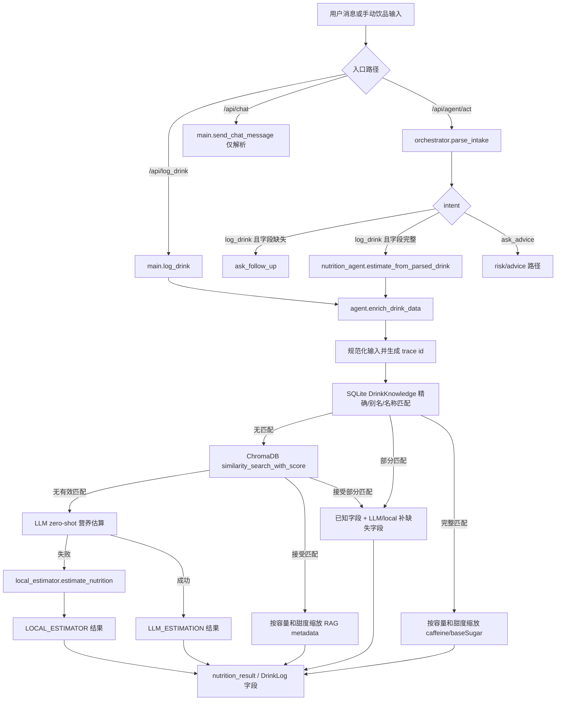

# Nutrition Estimation Pipeline 分析

日期：2026-06-09

范围：`backend/agent.py`、`backend/agents/nutrition_agent.py`、`backend/agents/orchestrator.py`、`backend/database.py`、`backend/tests`。

## 总结

当前 Nutrition Estimation Pipeline 是一条“查询优先 + 多级兜底”的混合流程：

1. 从用户文本解析饮品，或接收已经结构化的饮品对象。
2. 先查 SQLite 知识库精确匹配。
3. 再查 ChromaDB 向量匹配。
4. 知识缺失时调用 LLM 估算。
5. LLM 失败时使用本地规则兜底。
6. 返回 `caffeine`、`sugarContent`、`confidence`、`reasoning`、`estimation_method`、`matched_knowledge_id`、`retrieval_score`。

这套接口已经具备 Agent 化估算的雏形，但核心思路仍然是“先找精确营养数据，找不到再猜”。新主线应该升级为：“先拆解饮品组成，再基于组成估算咖啡因和糖分，同时把 SQL/RAG 作为证据或校准来源”。

## 当前流程图



## 入口、出口和调用链

### 手动记录饮品

入口：`backend/main.py` 的 `POST /api/log_drink`。

输入：

- `DrinkInput`：brand、name、type、sugar、volume、用户传入的 caffeine/sugar 占位值、时间字段、解释性字段。

调用链：

- `main.log_drink` 强制设置 `data_source = "用户录入"`。
- 调用 `agent.enrich_drink_data(drink_dict, db)`。
- 保存或更新 `DrinkLog`。
- 如果 `reasoning` 是 list，会转成 JSON 字符串存入数据库。

出口：

- API 返回 success 和当天统计洞察。
- `DrinkLog` 中保存估算出的营养数据和解释性字段。

### Agent act 记录饮品

入口：`backend/main.py` 的 `POST /api/agent/act`。

输入：

- 自然语言 `message` 和 `date`。

调用链：

- `orchestrator.run_agent_orchestrator`。
- `parse_intake` 节点调用 `agents/intake_parser.py`，后者只是委托给 `agent.parse_intake_message`。
- `log_drink_gate` 在字段缺失时追问。
- `estimate_nutrition` 节点调用 `nutrition_agent.estimate_from_parsed_drink`。
- `nutrition_agent` 构造 draft drink，然后调用 `agent.enrich_drink_data`。
- orchestrator 补充 risk、memory updates，并把 `estimation_method` 写入 `tools_used`。
- `main.agent_act` 保存 `AgentTrace`。

出口：

- API 返回 `agent_state`。
- 当前不直接持久化 `DrinkLog`，而是通过 `final_action = "fill_log_form"` 准备一个 draft 表单。

### Chat 路径

入口：`backend/main.py` 的 `POST /api/chat`。

输入：

- 自然语言 `message` 和 `date`。

调用链：

- 保存用户聊天消息。
- 调用 `parse_intake_message`。
- 如果识别为完整饮品记录，只返回结构化饮品确认文案。
- 当前不调用 `nutrition_agent`，也不调用 `enrich_drink_data`。

出口：

- API 返回 `parsed_intake` 和 trace。
- 这条路径目前不会执行营养估算。

## 每一步输入输出

### 1. Intake parsing

代码：

- `backend/agent.py`：`parse_intake_message`、`_parse_intake_locally`。
- `backend/agents/intake_parser.py`：薄 wrapper。

输入：

- 用户中文自然语言消息。

输出：

- `intent`
- `brand`
- `name`
- `type`
- `volume`
- `sugar`
- `time`
- `confidence`
- `missing_fields`
- `follow_up`

说明：

- 本地 parser 总是先跑。
- 只有当本地结果是 `log_drink` 且字段缺失，并且配置了真实 API key 时，才会尝试 LLM parser。
- 在 orchestrator 中，只要存在 `missing_fields`，就不会进入 Nutrition Estimation Pipeline，而是先追问。

### 2. Draft drink 规范化

代码：

- `backend/agents/nutrition_agent.py`：`estimate_from_parsed_drink`。

输入：

- parsed drink、date、DB session。

输出：

- draft drink dict，包含默认值：
  - `id = draft_*`
  - 默认 `type = coffee`
  - 默认 `sugar = unknown`
  - 默认 `volume = 500`
  - `caffeine = 0.0`
  - `sugarContent = 0.0`
  - `status = draft`
  - `data_source = 用户录入`
  - 继承 parser confidence

说明：

- 这个模块目前主要是进入 `agent.enrich_drink_data` 的桥。
- 这里是未来 Composition Agent 最干净的 orchestrator-facing 插入点。

### 3. SQL knowledge match

代码：

- `backend/agent.py`：`_find_sql_knowledge_match`、`_normalize_match_name`、`_brand_key`、`_knowledge_scope`、`_apply_hybrid_knowledge_result`。
- 数据模型：`backend/database.py` 的 `DrinkKnowledge`。

输入：

- `brand`、`name`、`type`、`volume`、`sugar`。
- DB 表：`knowledge_base`。

匹配行为：

- 先检查 `brand == brand` 且 `name == name` 的精确匹配。
- 如果没有精确匹配，规范化 name 和 brand。
- 读取所有知识库行，按 canonical brand key 过滤，再允许 name 精确或子串匹配。

完整匹配输出：

- `caffeine = knowledge.caffeine * volume_ratio`
- `sugarContent = baseSugar 按容量和甜度缩放`
- `data_source = knowledge.source`
- `confidence = knowledge.confidence`
- `reasoning = ["SQL Exact Match ..."]`
- `estimation_method = "SQL_EXACT_MATCH"`
- `matched_knowledge_id`
- `retrieval_score = None`

部分匹配输出：

- 已知 caffeine 或 sugar 字段保留。
- 缺失字段通过 `_estimate_nutrition_with_fallback` 补齐。
- `estimation_method = HYBRID_SQL_EXACT_MATCH_LLM` 或 `HYBRID_SQL_EXACT_MATCH_LOCAL`。

当前 confidence 行为：

- SQL 完整匹配直接使用知识库 confidence。
- SQL 部分匹配使用知识库 confidence 和 fallback confidence 的较小值。

### 4. RAG / ChromaDB retrieval

代码：

- `backend/agent.py`：模块级 Chroma 初始化、`sync_chroma_document`、`delete_chroma_document`、`enrich_drink_data` 内部 RAG 分支。
- 数据同步入口：`backend/main.py` 的 knowledge-base 和 knowledge-acquisition approve endpoints。

输入：

- 查询字符串：`"{brand} {name}"`。
- Chroma metadata：id、brand、name、caffeine、sugar、source、confidence。

匹配行为：

- 调用 `similarity_search_with_score(..., k=1)`。
- 只有当 canonical brand 匹配，并且名称字符 overlap 至少为 1，或向量 score 小于 0.3 时，才接受匹配。

接受匹配输出：

- 字段形态与 SQL 类似，但：
  - `data_source = "RAG 向量检索匹配"`
  - `confidence = 0.8`
  - `estimation_method = "RAG_MATCH"`
  - `retrieval_score = score`

部分匹配输出：

- 复用 SQL 的 hybrid helper，method prefix 为 `RAG_MATCH`。

说明：

- `sync_chroma_document` 会把 brand/name/volume/caffeine/baseSugar 写进 document text。
- 但当前 metadata 没有写入 `volume`，RAG 分支却读取 `meta.get("volume", 500)`。这意味着 Chroma 召回非 500ml 知识时，缩放逻辑会静默按 500ml 处理。

### 5. LLM estimation

代码：

- `backend/agent.py`：`_estimate_nutrition_with_fallback`，用于 hybrid 缺失字段。
- `backend/agent.py`：`enrich_drink_data` 中直接 LLM zero-shot 分支。

输入：

- brand、name、drink type、volume、sweetness。

输出：

- `caffeine`
- `sugar` 或 `sugarContent`
- `source = AI model estimate` 或 `AI 大模型估算`
- `method = LLM` 或 `estimation_method = LLM_ESTIMATION`
- `confidence = 0.75`
- 简短 reasoning 字符串/list

说明：

- 直接 LLM prompt 已经有 Composition Agent 的雏形：提到了 espresso shots、milk lactose、oat milk、coconut water、fruit tea、added sugar。
- 但输出 schema 只有最终数值和一句 prose reasoning，没有稳定的结构化组成拆解。

### 6. Local fallback rules

代码：

- `backend/local_estimator.py`：`estimate_nutrition`。

输入：

- brand、name、drink type、volume、sugar level。

行为：

- 自己打开一个 `SessionLocal`，不复用请求里的 DB session。
- 优先按 brand + type 从 `DrinkKnowledge` 动态计算平均密度。
- 没有品牌数据时，按 type 计算平均密度。
- 再没有时，使用硬编码密度：
  - coffee：50mg caffeine/100ml，2g sugar/100ml
  - milktea：16mg caffeine/100ml，5g sugar/100ml
  - tea：10mg caffeine/100ml
  - 其他：0mg caffeine/100ml，4g sugar/100ml
- 按 sweetness multiplier 调整糖分。

输出：

- `caffeine`
- `sugar`
- `source = "Local Estimator (Dynamic DB)"`
- `confidence = 0.65`
- `reasoning` list

说明：

- `unknown` 糖在这里默认按 0.5 处理，但 `enrich_drink_data` 用 SQL/RAG 缩放时把 unknown 当 1.0。这会导致不同 method 的估算不一致。
- 平均密度计算时，sum 内部跳过了无 volume 的行，但分母仍然是 `len(records)`。如果存在异常行，平均值会被压低。

## 当前解释性字段

持久化在 `DrinkLog` 上的字段：

- `data_source`
- `confidence`
- `reasoning`
- `estimation_method`
- `matched_knowledge_id`
- `retrieval_score`
- `agent_trace_id`

`enrich_drink_data` 返回的解释：

- SQL/RAG 完整匹配：一行说明 match、容量缩放、甜度应用。
- SQL/RAG 部分匹配：两行说明已知字段和 fallback method。
- LLM：一行 AI reasoning。
- Local：多行密度与甜度 reasoning。

Agent trace：

- `orchestrator._nutrition_log_node` 会把 estimator method 加入 `tools_used`。
- 如果匹配到知识库 ID，会加入 `retrieved_docs`。

## 当前测试

Nutrition 相关测试：

- `test_local_estimator_fallback_returns_numbers`
- `test_sql_exact_match_adds_explainability_fields`
- `test_partial_sql_match_uses_hybrid_estimation`
- `test_sql_match_allows_minor_name_suffix`
- `test_sql_match_allows_brand_alias`

API / orchestrator 测试：

- `test_parse_intake_api_returns_structured_json`
- `test_agent_act_records_trace`
- `test_memory_preferences_can_be_written_and_cleared`
- `test_orchestrator_routes_advice_question`

Knowledge acquisition 测试：

- evidence 可以 staged、approved，并以 `caffeine_only`、`sugar_only`、`caffeine_sugar` scope 合并到 `DrinkKnowledge`。

测试缺口：

- 没有直接测试 RAG 接受/拒绝逻辑。
- 没有测试 `enrich_drink_data` 在 LLM 不可用时的 fallback 行为。
- 没有 component-level reasoning 测试，因为当前还没有结构化组成模型。
- 没有测试 `reasoning` 保存到 `DrinkLog` 后的 schema。

## 当前问题

1. 核心估算仍然以产品数据为中心，而不是以组成拆解为中心。

最强路径是 exact SQL/RAG product match。如果没有产品数据，就跳到 LLM 或平均密度。这和新主线“可解释的饮品组成拆解”还差一层核心能力。

2. LLM 的组成推理没有结构化。

LLM prompt 已经包含营养常识，但输出只有 `caffeine`、`sugar`、`reasoning`。缺少稳定的 component list，例如 espresso shots、milk base、syrup、fruit base、topping、tea base、added sugar。

3. SQL 和 RAG 的糖分缩放模型过粗。

当前把 `baseSugar` 当作全糖总糖，并统一假设 20% natural sugar + 80% added sugar。这个规则对奶基、果茶、椰子水、无糖咖啡都太粗。

4. method confidence 太粗。

SQL 完整匹配基本继承 source confidence；RAG 固定 0.8；LLM 固定 0.75；Local 固定 0.65。confidence 没有反映组成不确定性、配方假设、杯型缺失、甜度不确定等因素。

5. `agent.py` 责任过重。

它同时包含 intake parsing、Chroma sync、knowledge matching、hybrid estimation、LLM estimation、local fallback orchestration、health reports、companion chat。后续要升级 nutrition 核心能力时，容易牵动无关逻辑。

6. RAG metadata 可能丢失 volume。

`sync_chroma_document` 把 volume 写进文本，但没写入 metadata。RAG 分支读取 `meta.get("volume", 500)`，因此非 500ml 知识会被错误缩放。

7. local estimator 不使用当前 DB session。

`local_estimator.estimate_nutrition` 自己打开 `SessionLocal`。功能上能跑，但会削弱测试隔离，也让事务行为更难理解。

8. `/api/chat` 解析饮品但不估算营养。

`/api/agent/act` 会进入 `nutrition_agent`；`/api/chat` 只返回 parsed object 和确认文案。如果前端通过 chat 完成记录，两条路径行为会不一致。

9. explainability shape 不一致。

`reasoning` 在不同路径下可能是 list，也可能是 string；存库时又转为 JSON string。当前没有 typed structure 来表达 evidence、assumptions、components、formula。

## 应该保留的逻辑

- 保留 exact SQL match，作为高可信证据路径。
- 保留 brand alias 和 normalized name matching。
- 保留 knowledge scopes：`complete`、`caffeine_sugar`、`caffeine_only`、`sugar_only`、`alcohol_only`、`partial`。
- 保留 hybrid 补缺失字段的思想，但把缺失字段 estimator 从 LLM/local guess 改成 Composition Estimation。
- 保留 ChromaDB retrieval，但把它定位为弱证据，而不是主估算引擎。
- 保留 `confidence`、`reasoning`、`estimation_method`、`matched_knowledge_id`、`retrieval_score`、`agent_trace_id`；这些是正确的输出表面。
- 保留 `nutrition_agent.estimate_from_parsed_drink` 作为 orchestrator-facing 边界。
- 保留现有 SQL exact/partial/alias 测试作为回归测试。

## 应该重构的逻辑

- 把 nutrition-specific 代码从 `agent.py` 中移到 nutrition/composition 模块。
- 用 typed composition schema 替代 final-number LLM estimation。
- 用 component-specific sugar calculation 替代全局 20% natural / 80% added sugar 假设。
- 统一 SQL、RAG、composition、local fallback 对 `unknown` 甜度的处理。
- 让 local fallback 接受可选 DB session，或抽出共享 stats provider。
- 为所有 method 建立统一 typed result contract：
  - totals
  - components
  - assumptions
  - evidence
  - confidence
  - method
- 一致地把 structured reasoning 存成 JSON。
- 把 RAG match 作为 retrieved evidence 或 calibration example；除非匹配非常强，否则不要直接当权威产品数据。

## Composition Agent 应该插入到哪里

推荐第一插入点：

- `backend/agents/nutrition_agent.py`

当前：

```text
estimate_from_parsed_drink(parsed_drink, date, db)
  -> build draft drink
  -> enrich_drink_data(draft, db)
```

建议：

```text
estimate_from_parsed_drink(parsed_drink, date, db)
  -> build draft drink
  -> composition_agent.estimate_composition(draft, db)
  -> return existing-compatible nutrition result
```

为什么这里合适：

- orchestrator 已经把 `nutrition_agent` 当成 nutrition 边界。
- 不需要改 intake parsing、risk、memory、trace 行为。
- manual `/api/log_drink` 路径可以后续再迁移到同一个 nutrition service。

第二插入点：

- `agent.enrich_drink_data` 内部，在 LLM zero-shot 分支之前。

短期兼容流程：

```text
SQL exact complete -> 保留
SQL/RAG partial -> Composition Agent 估算缺失字段
No match -> Composition Agent
Composition failure -> 现有 LLM 分支
LLM failure -> local_estimator
```

这样可以保持现有测试尽量不动，同时让 composition 成为主 fallback。

长期目标流程：

```text
Input drink
  -> exact SQL evidence lookup
  -> optional RAG evidence lookup
  -> Composition Estimation Agent
       -> component decomposition
       -> caffeine calculation
       -> sugar calculation
       -> confidence calculation
       -> explainability payload
  -> local fallback only if composition fails
```

在长期目标里，SQL/RAG 变成 evidence providers 和 calibration sources。除非是 exact complete match，否则不应该绕过 composition。

## 建议的 Composition Result Shape

为了兼容现有前端/接口，先保留当前顶层字段：

```json
{
  "caffeine": 150.0,
  "sugarContent": 18.5,
  "data_source": "Composition Estimation Agent",
  "confidence": 0.78,
  "reasoning": ["..."],
  "estimation_method": "COMPOSITION_ESTIMATION",
  "matched_knowledge_id": null,
  "retrieval_score": null
}
```

新增结构化详情：

```json
{
  "composition": {
    "components": [
      {
        "name": "espresso",
        "amount": 2,
        "unit": "shot",
        "caffeine_mg": 150,
        "sugar_g": 0,
        "confidence": 0.8,
        "basis": "latte-style coffee; large cup"
      },
      {
        "name": "milk",
        "amount": 250,
        "unit": "ml",
        "caffeine_mg": 0,
        "sugar_g": 12.5,
        "confidence": 0.7,
        "basis": "milk lactose about 5g/100ml"
      }
    ],
    "sweetness": {
      "level": "three",
      "added_sugar_g": 10,
      "multiplier": 0.3
    },
    "assumptions": [
      "Large latte usually contains 2 espresso shots.",
      "Milk volume estimated after espresso and ice."
    ],
    "evidence": [
      {
        "type": "sql_exact_match",
        "knowledge_id": "..."
      }
    ]
  }
}
```

初期可以先把它放进 `reasoning` 的 JSON 中，后续再加 DB column。

## 实施计划

### Phase 1：分析

状态：本文档。

不改业务代码。

### Phase 2：在现有 contract 后面新增 composition module

文件：

- 新增 `backend/agents/composition_agent.py`。
- 新增 `backend/tests/test_composition_agent.py`。
- 轻量更新 `backend/agents/nutrition_agent.py`，让它调用 composition，或调用共享 estimator service。

行为：

- 根据 drink type/name/brand/volume/sugar 做组成拆解。
- 返回兼容现有字段的结果，并附带可选 `composition`。
- 第一阶段不需要前端改动。

### Phase 3：重构 `enrich_drink_data`

文件：

- `backend/agent.py`
- 可能新增 `backend/agents/nutrition_pipeline.py` 或 `backend/services/nutrition_pipeline.py`

行为：

- 拆出 lookup、evidence retrieval、composition estimation、fallback。
- 保留 `enrich_drink_data` 作为兼容 wrapper。
- 把 partial-match fallback 改成 Composition Agent。

### Phase 4：持久化和 trace 升级

文件：

- `backend/database.py`
- `backend/main.py`
- `backend/tests/test_api.py` 和 nutrition/composition tests

行为：

- 增加可选 `composition_json`，或统一 `reasoning` 的 JSON 编码。
- trace tool 增加 `COMPOSITION_ESTIMATION`。
- 确保 SQL/RAG evidence IDs 进入 `retrieved_docs`。

### Phase 5：重新定位 RAG

文件：

- `backend/agent.py` 的 Chroma sync 和 retrieval 逻辑。
- Knowledge acquisition tests。

行为：

- 给 Chroma metadata 添加 `volume`。
- 返回 top-k evidence candidates，而不是只返回 k=1。
- Composition Agent 消费 evidence，但仍解释自己的组成计算。

## 建议下一步修改的文件

1. `backend/agents/composition_agent.py`

新增结构化 estimator。第一版先做 deterministic component rules，LLM 后续再接 typed schema。

2. `backend/tests/test_composition_agent.py`

覆盖：

- 大杯拿铁 / espresso shot 估算
- 生椰乳或椰子水天然糖
- 牛奶乳糖
- 果茶糖分
- 无糖仍保留天然糖
- unknown 甜度带来的 confidence penalty

3. `backend/agents/nutrition_agent.py`

把这里作为 nutrition estimation 的主公共边界。保持输出与当前 orchestrator tests 兼容。

4. `backend/agent.py`

等 composition tests 稳定后再重构。保留 `enrich_drink_data` 作为 wrapper，避免破坏手动记录和现有测试。

5. `backend/database.py`

后续增加 structured composition 存储字段，或正式规范 `reasoning` JSON 编码。

6. `backend/tests/test_nutrition_agent.py`

扩展当前 SQL/partial tests，断言 Composition Agent 被用于缺失字段：

- `HYBRID_SQL_EXACT_MATCH_COMPOSITION`
- `COMPOSITION_ESTIMATION`
- structured component payload 存在

7. `backend/tests/test_api.py`

增加 `/api/agent/act` 的 log-drink 测试，检查 `tools_used` 包含 composition estimation，并确认输出仍兼容 draft form。

## 暂未修复的小 bug / 风险

- Chroma metadata 没有 `volume`，但 RAG 缩放逻辑读取它。
- `local_estimator` 在存在无效 volume 行时，平均密度可能偏低。
- `unknown` 糖在 SQL/RAG 中接近全糖，在 local fallback 中接近半糖。
- `/api/chat` 可以解析完整饮品，但不估算营养。
- Nutrition 逻辑集中在 `agent.py`，后续改动风险较高。

